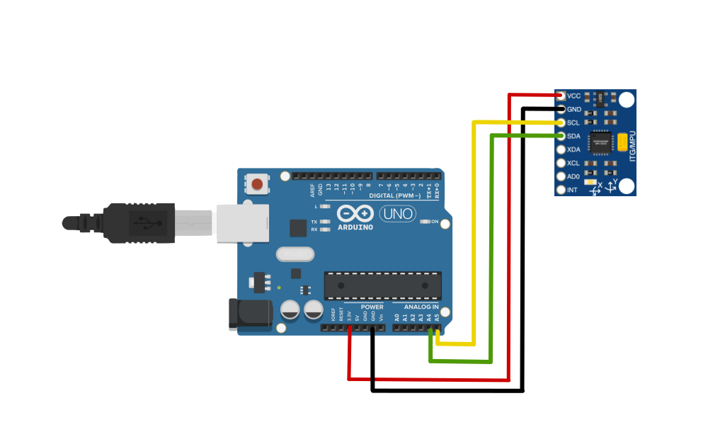

# mpu6050_imu_ros

Arduino code(mpu6050_imu_driver/firmware) employing rosserial to retrieve a quaternion from the mpu6050 DMP. 

Then, another ROS node(mpu6050_imu_converter) publishing IMU & Pose messages to ROS. 

The package is tested on Arduino Uno compatible & Asus Tinker board(Raspiberry Pi or PC maybe OK).

# Test Environment

・MPU-6050 GY521

・Arduino UNO

・ROS Noetic

・Ubuntu 20.04

# Wiring



# Installing
```bash
$sudo apt-get update
$sudo apt-get install ros-noetic-rosserial-arduino
$sudo apt-get install ros-noetic-serial
$cd ~catkin_ws/src/
$git clone -b noetic https://github.com/ccny-ros-pkg/imu_tools
$cd ..
$catkin_make --pkg imu_tools


$cd ~/catkin_ws/src/
$git clone https://github.com/soarbear/mpu6050_imu_ros.git
$cd ~/catkin_ws/
$catkin_make


$sudo ls -l /dev/ttyACM*
$sudo chmod +x /dev/ttyACM0
$roslaunch mpu6050_imu_driver mpu6050_imu.launch
```

# Demo
```bash
$roslaunch mpu6050_imu_driver mpu6050_imu.launch
```


# Explanation

<a href="https://memo.soarcloud.com/mpu6050%e3%82%92%e3%83%ad%e3%83%9c%e3%83%83%e3%83%88%e3%81%ab%e7%b5%84%e3%81%bf%e8%be%bc%e3%82%82%e3%81%86/">Explained in Japanese</a>

# Reference

<a href="https://github.com/jrowberg/i2cdevlib">jrowberg/i2cdevlib</a>

# Todo

Optimization
